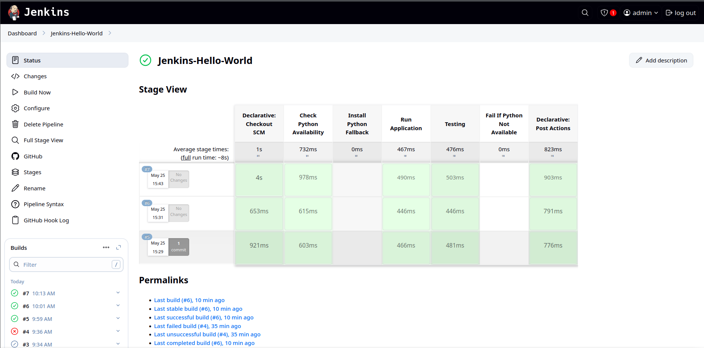

# Jenkins Hello World CI/CD

A simple Jenkins CI/CD pipeline demonstration for a Python "Hello World" application, showcasing automated builds, tests, and deployments.

## 📁 Project Structure

```
jenkins-hello-world/
├── app.py               # Main application script
├── test_app.py          # Unit tests for the application
├── requirements.txt     # Python dependencies
└── Jenkinsfile          # Jenkins pipeline definition
```

## 🚀 Getting Started

### Prerequisites

- Python 3.x
- Jenkins (version 2.0 or higher)
- Required Jenkins plugins:
  - Pipeline
  - Git
  - Python

### Setup Instructions

1. **Clone the Repository**
   ```bash
   git clone https://github.com/SyedSaifuddin045/jenkins-hello-world.git
   cd jenkins-hello-world
   ```

2. **Install Dependencies**
   ```bash
   pip install -r requirements.txt
   ```

3. **Run the Application**
   ```bash
   python app.py
   ```

4. **Execute Tests**
   ```bash
   python -m unittest test_app.py
   ```

## 🛠️ Jenkins Pipeline

The `Jenkinsfile` defines a declarative pipeline with these stages:

- **Checkout**: Retrieves code from Git repository
- **Install Dependencies**: Installs Python packages from `requirements.txt`
- **Run Tests**: Executes unit tests for code validation
- **Deploy**: Optional deployment to target environment

### Pipeline Success Example



*Example of a successful pipeline execution showing all stages completed*

## 🖥️ Jenkins Agents Best Practices

- **Use Dedicated Agents**: Run builds on dedicated agent nodes, not the Jenkins master
- **Secure Communication**: Ensure encrypted and authenticated master-agent communication
- **Limit Permissions**: Configure agents with minimum necessary permissions

## 🔒 Security Considerations

- **Regular Updates**: Keep Jenkins and plugins updated
- **Role-Based Access Control**: Implement RBAC for user permissions
- **Secure Credentials**: Use Jenkins Credentials Plugin for sensitive data
- **Enable HTTPS**: Configure secure communication
- **Agent Restrictions**: Limit agent-to-master access

## 📄 License

This project is licensed under the MIT License.

## 🤝 Contributing

Contributions welcome! Please fork the repository and submit a pull request.

## 📫 Contact

For questions or suggestions, open an issue in the repository.
